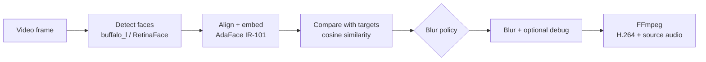

<div align="center">

# Occulta

**Choose who stays visible. Blur everyone else — or flip it.**

[](https://www.python.org/)
[](https://pytorch.org/)
[](https://streamlit.io/)
[](https://docs.astral.sh/uv/)
[](LICENSE)

[What it does](#what-it-does) · [How it works](#how-it-works) · [Run it](#run-it) · [Streamlit](#streamlit) · [CLI](#cli)

</div>

## Why Occulta?

Occulta started as a practical experiment: **can a video anonymizer recognize
the people I care about and decide who should actually be blurred?**

Instead of hiding every detected face, Occulta lets you define one or more
targets. In the default mode, targets remain visible and everyone else is
blurred. With one option, the behavior is reversed: targets are blurred and
other valid faces remain visible.

Everything runs locally. You can use the CLI for repeatable jobs or open the
Streamlit interface, jump to any frame, and click directly on the faces you
want to use as references.

> [!NOTE]
> This is a personal computer-vision project, not a biometric security product.
> Use authorized media, tune the threshold for your footage, and review the
> complete output before sharing it.

## What it does

- Detects faces with the `buffalo_l` RetinaFace detector from InsightFace.
- Aligns faces and generates 512-dimensional AdaFace IR-101 embeddings.
- Compares every detected face against up to 32 reference images.
- Keeps or blurs faces according to the selected mode.
- Always blurs faces whose alignment or embedding fails.
- Runs face embeddings in batches and comparisons as a single matrix operation.
- Can analyze every _N_ frames and reuse the last result in between.
- Preserves the original audio stream when the video has one.
- Offers debug boxes with similarity, matched target, identity, and action.
- Keeps target embeddings in memory instead of saving them to disk.

## How it works

The processing pipeline uses Chain of Responsibility: each handler receives the
same frame context, adds its result, and hands it to the next stage.



For each face, Occulta keeps the highest cosine similarity found across all
references. A score equal to or above the threshold is considered a target.
If multiple references tie, the first one in the deterministic target order
wins.

| Face result | Default mode | Blur-target mode |
|---|---:|---:|
| Score `>= threshold` | Keep | Blur |
| Score `< threshold` | Blur | Keep |
| Invalid face embedding | Blur | Blur |

### Current defaults

| Setting | Default |
|---|---:|
| Similarity threshold | `0.40` |
| Analyze every | `3` frames |
| Detector input | `416×416` |
| AdaFace input | `3×112×112`, normalized to `[-1, 1]` |
| Reference limit | `32` |
| Blur margin | `15%` |
| Video output | H.264, CRF `18`, preset `veryfast` |
| Debug overlay | Off |

## Run it

### Requirements

- Python `3.11` (`>=3.11,<3.12`)
- [uv](https://docs.astral.sh/uv/getting-started/installation/)
- [FFmpeg](https://ffmpeg.org/download.html) available on `PATH`
- A compatible AdaFace IR-101 checkpoint

### Install

```bash
git clone https://github.com/JonatasMSS/Occulta.git
cd Occulta
uv sync --extra ui
```

Only using the CLI? `uv sync` is enough. The `ui` extra installs Streamlit and
the image-coordinate component used for face selection.

### Add the model

Occulta does not download or include the AdaFace checkpoint. Put your compatible
state dictionary here:

```text
models/
└── adaface_ir101/
    └── model.pt
```

The CLI accepts another location through `--model`. Streamlit uses the default
path or the `FACE_BLUR_MODEL_PATH` environment variable.

InsightFace downloads `buffalo_l` on its first use and caches it under the
current user's `.insightface` directory.

## Streamlit

```bash
uv run streamlit run streamlit_app.py
```

Open [http://localhost:8501](http://localhost:8501), then:

1. Upload an MP4 file of up to 500 MB.
2. Move to a frame with the slider.
3. Click a detected face to add it as a target.
4. Visit other frames if you want more people or different poses.
5. Check the aligned `112×112` targets in the right-hand gallery.
6. Pick the blur mode, threshold, frame interval, detector size, and debug mode.
7. Process, preview, and download the result.

Clicking the same face again removes it. Clicking outside a box changes
nothing. If boxes overlap, the smallest box containing the click wins.

Uploads live in a session-specific temporary directory. Aligned faces and
embeddings stay in memory, while completed videos are written to `outputs/`.

## CLI

### Keep one target visible

```bash
uv run face-blur \
  --video video.mp4 \
  --target target.jpg \
  --output outputs/anonymized.mp4
```

### Use a folder of targets

```bash
uv run face-blur \
  --video video.mp4 \
  --targets-dir targets/ \
  --output outputs/anonymized.mp4 \
  --threshold 0.40 \
  --process-every 3 \
  --det-size 416
```

### Blur the target and show debug data

```bash
uv run face-blur \
  --video video.mp4 \
  --target target.jpg \
  --output outputs/target_blurred.mp4 \
  --blur-target \
  --debug
```

### Options

| Option | Default | What it controls |
|---|---:|---|
| `--video PATH` | Required | Input video |
| `--target PATH` | One target source | Image containing exactly one face |
| `--targets-dir PATH` | One target source | Folder containing one face per image |
| `--output PATH` | Required | Output MP4 path |
| `--model PATH` | `models/adaface_ir101/model.pt` | AdaFace checkpoint |
| `--threshold FLOAT` | `0.40` | Target similarity threshold in `[-1, 1]` |
| `--process-every INT` | `3` | Analyze every _N_ frames |
| `--det-size INT` | `416` | Square detector input size |
| `--debug` | Off | Add boxes, scores, and decisions to the output |
| `--blur-target` | Off | Blur targets instead of non-targets |

`--target` and `--targets-dir` are mutually exclusive. A target folder accepts
`.jpg`, `.jpeg`, `.png`, and `.webp` files from its top level, sorted by name.
Every image must be readable and contain exactly one detected face. Invalid
references stop the run before the video is processed.

## CPU and CUDA

No device flag is needed. AdaFace chooses CUDA when
`torch.cuda.is_available()` is true and otherwise uses CPU. The detector uses
`CUDAExecutionProvider` when both CUDA and the provider are available; otherwise
it falls back to `CPUExecutionProvider`.

The regular environment installs ONNX Runtime CPU. To try the detector on an
NVIDIA GPU:

```bash
uv sync --extra ui
uv pip uninstall onnxruntime
uv pip install onnxruntime-gpu==1.29.0
uv run --no-sync streamlit run streamlit_app.py
```

The host still needs a CUDA-enabled PyTorch build, compatible NVIDIA drivers,
and the runtime libraries required by ONNX Runtime. Occulta displays the
AdaFace device and detector provider after initialization.

Quick runtime check:

```bash
uv run --no-sync python -c "import torch, onnxruntime as ort; print('PyTorch CUDA:', torch.cuda.is_available()); print('ONNX providers:', ort.get_available_providers())"
```

## Output details

- Frames are sent directly to FFmpeg instead of being accumulated in memory.
- The final MP4 uses `libx264`, CRF 18, `veryfast`, `yuv420p`, and `+faststart`.
- Source audio is copied when present; videos without audio remain silent.
- Partial outputs are removed after a processing or encoding failure.
- Frames without detected faces remain unchanged.

## Project layout

```text
Occulta/
├── main.py                 # CLI entry point
├── streamlit_app.py        # Local UI entry point
├── models/adaface_ir101/   # Checkpoint location
├── src/face_blur/
│   ├── app.py              # CLI and shared video pipeline
│   ├── adaface.py          # IR-101 architecture and model loading
│   ├── pipeline.py         # Chain contracts and frame state
│   ├── web.py              # Streamlit workflow
│   └── handlers/           # Detection → embedding → match → blur → write
└── tests/
```

## Tests

```bash
uv run --extra ui python -m unittest discover -s tests -v
```

The suite covers the processing chain, frame cache, batched embeddings,
multi-target matching, blur policies, failure cleanup, click selection,
progress callbacks, and a basic Streamlit smoke test.

## Things to know

- There is no tracking yet. Between analyzed frames, Occulta reuses the latest
  boxes and decisions, so fast motion can cause temporary misalignment.
- The detector can miss a face completely. Without a bounding box, Occulta has
  no region to blur and that face may remain visible in the output.
- Face matching can produce false accepts or false rejects. This may keep a
  person visible when they should be blurred, or blur the wrong person,
  depending on the selected anonymization mode.
- `0.40` is a starting threshold, not a magic number. Use debug mode and tune
  it with footage similar to your real use case.
- Pose, light, occlusion, motion blur, image quality, and dataset bias can all
  affect face matching.
- Selecting multiple poses does not create a person profile; every selection is
  simply another independent reference.
- The Streamlit app is meant for local, single-user use. It has no auth, queue,
  or background workers.
- Face embeddings are biometric data. Process authorized media and protect the
  input, debug, and output videos accordingly.

## Built on great work

Occulta is a personal project, but its computer-vision foundation comes from
people who did the hard research first:

- **AdaFace** — Minchul Kim, Anil K. Jain, and Xiaoming Liu.
  [CVPR 2022 paper](https://openaccess.thecvf.com/content/CVPR2022/html/Kim_AdaFace_Quality_Adaptive_Margin_for_Face_Recognition_CVPR_2022_paper.html) · [official code](https://github.com/mk-minchul/AdaFace)
- **RetinaFace** — Jiankang Deng, Jia Guo, Evangelos Ververas, Irene Kotsia,
  and Stefanos Zafeiriou. [CVPR 2020 paper](https://openaccess.thecvf.com/content_CVPR_2020/html/Deng_RetinaFace_Single-Shot_Multi-Level_Face_Localisation_in_the_Wild_CVPR_2020_paper.html)
- **InsightFace** — the face-analysis toolkit and `buffalo_l` model pack.
  [project](https://github.com/deepinsight/insightface) · [model zoo](https://github.com/deepinsight/insightface/tree/master/model_zoo)

## License

The code written for Occulta is available under the [MIT License](LICENSE).

That license does not cover third-party papers, datasets, model packs, or
checkpoints. InsightFace currently documents its pretrained model packs as
non-commercial research assets unless a separate license is obtained. Check
each upstream project's current terms before using its models or weights.

---

<div align="center">
Made while exploring face recognition, video processing, and practical privacy tools.
</div>
